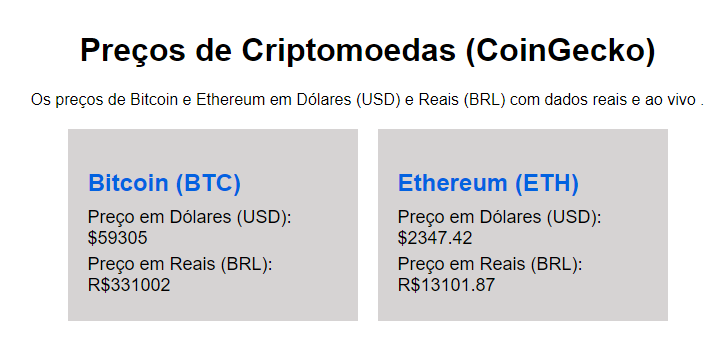

# POC-04-Fletcher-

## Contexto
Criamos uma página web com Js, html e css que mostra os valores reais das criptos moedas( Bitcoin e Ethereum). Para isso usamos o Flecher do JavaScript.



### API 


Pegamos a API CoinGecko.


### Codigo 

Primeiro criamos uma função assincrona, para não ser executada da forma normal do começo ao fim.

```javascript

  async function fetchCryptoPrices() {
  
```

Pegamos a url da API guardamos no const, usamos o await para indicar que o JS deve esperar a resposta da API seja recebida antes de continuar com a execução do código.
O fetch é usado para fazer a requisição HTTP para a URL da API.Ele retorna uma Promise (uma promessa).

```javascript
    const response = await fetch(url);
    const prices = await response.json();

```
